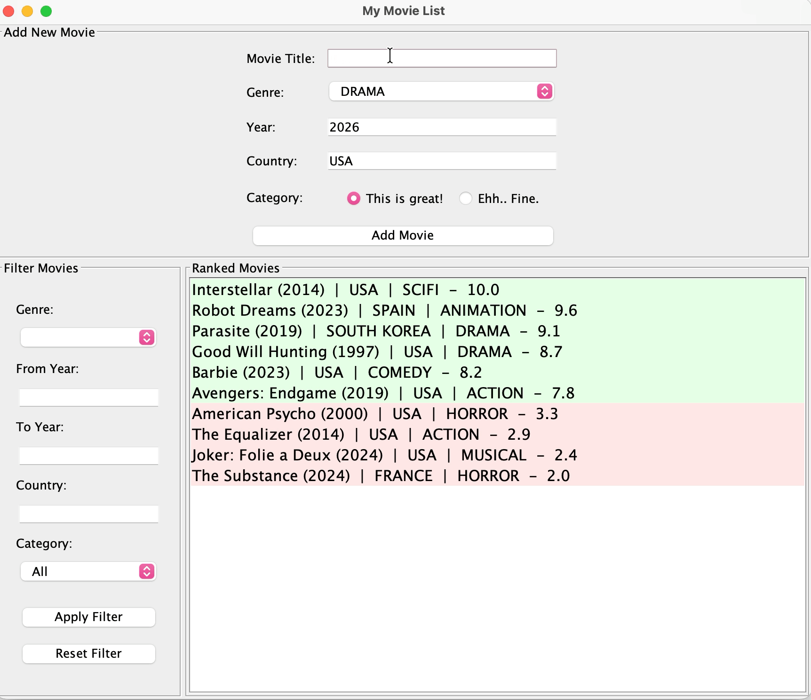
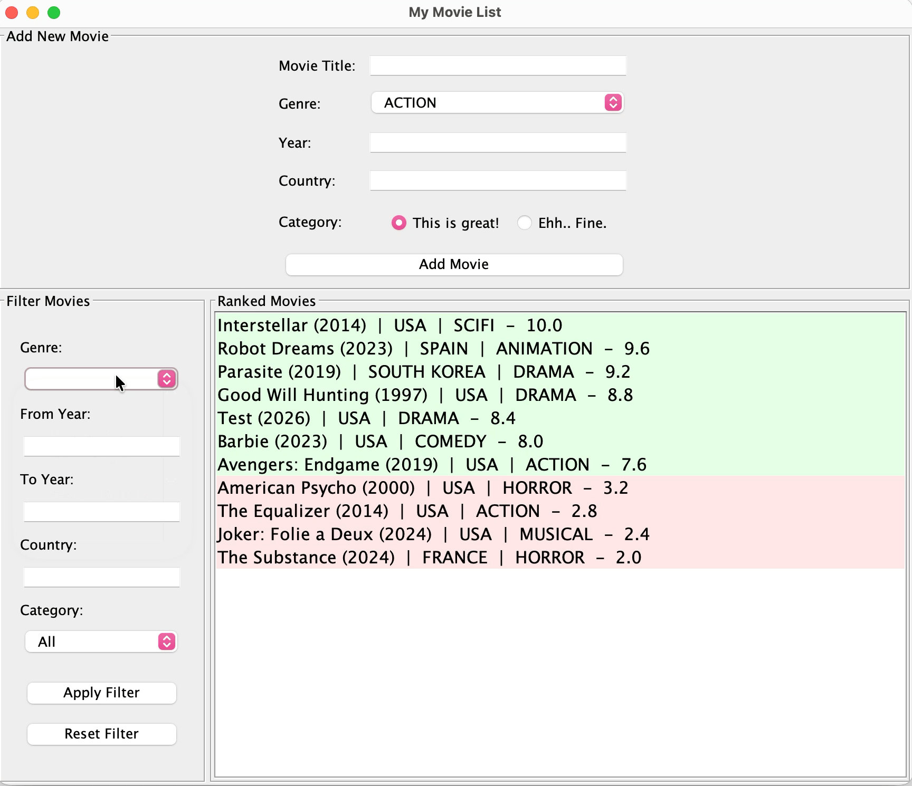

# Application Overview
*Rated* is a movie Ranking & list keeping desktpp application built in Java that enables users to rank and manage movies through an interactive binary comparison system.

Inspired by modern ranking-based apps, the system replaces traditional 1–10 rating scales with pairwise comparisons, reducing rating inflation and improving ranking precision. Users are repeatedly presented with two movies and choose their preferred one, while the application dynamically updates rankings using a binary-search–based insertion algorithm for efficient positioning.

The application is designed using a strict MVC architecture:
- Model encapsulates movie data and ranking logic
- View handles user interaction and rendering
- Controller processes user input and coordinates state updates

The system emphasizes:
- Encapsulation and loose coupling
- Defensive copying and data hiding
- Clean separation of responsibilities
- Extensible design for future features (persistence, import/export, API integration)

# Technologies
Language & Core Concepts
- Java (OOP principles, Generics, Enums, Exception Handling)
- Java Swing for desktop UI
- MVC Architecture

Algorithms & Data Structures
- Custom binary search–based ranking engine for efficient insertion and ordering
- Dynamic scoring and pairwise comparison logic
- Comparator interface for flexible ranking strategies
- Java Streams and Lambda Expressions for functional-style data processing

Testing & Reliability
- Built JUnit 5 test suite to validate controller logic and Swing UI behavior
- Simulated user interactions (form input, button clicks) to verify input validation and duplicate handling
- Tested error-handling paths to prevent runtime crashes and ensure stable UX

# Application Demo
Add movie + Binary comparison

Filter movie list

